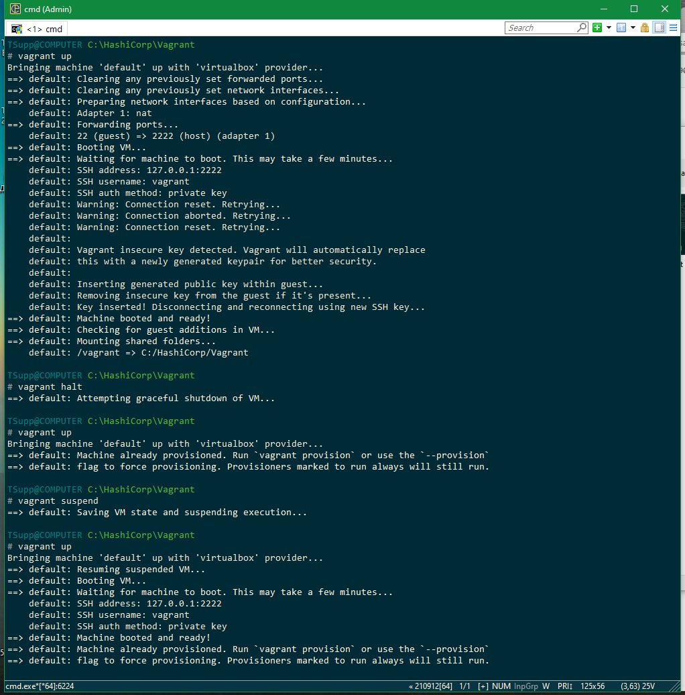
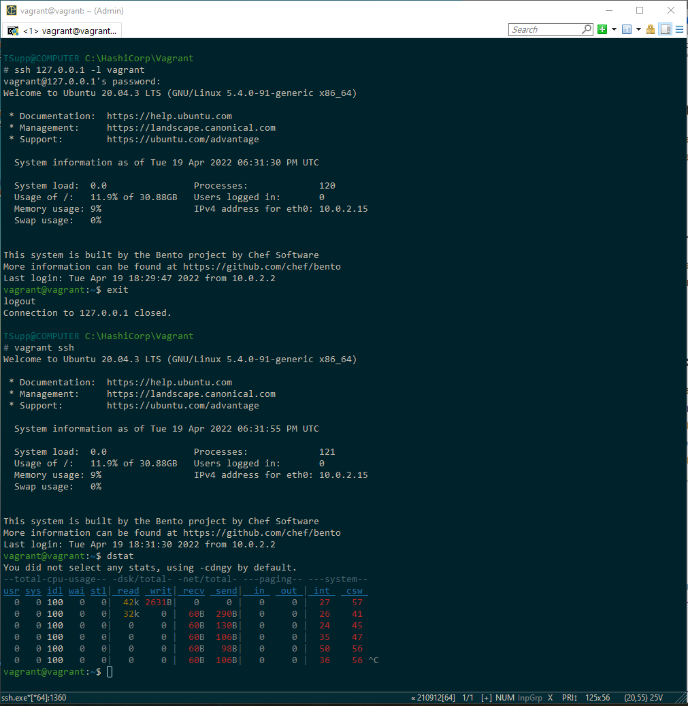
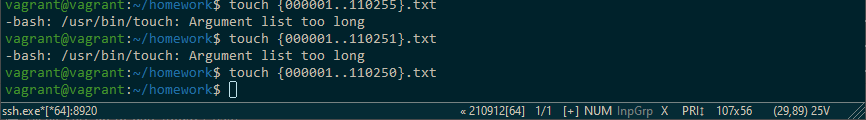
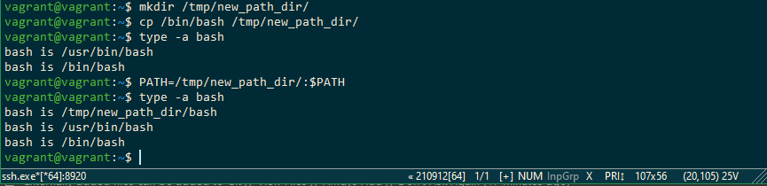

## Домашнее задание 3.1
1. Установите средство виртуализации Oracle VirtualBox.
2. Установите средство автоматизации Hashicorp Vagrant.
3. В вашем основном окружении подготовьте удобный для дальнейшей работы терминал.
4. С помощью базового файла конфигурации запустите Ubuntu 20.04 в VirtualBox посредством Vagrant.

Решение 1-4:
5. Ознакомьтесь с графическим интерфейсом VirtualBox, посмотрите как выглядит виртуальная машина, которую создал для вас Vagrant, какие аппаратные ресурсы ей выделены. Какие ресурсы выделены по-умолчанию?
Решение 5:
6. Ознакомьтесь с возможностями конфигурации VirtualBox через Vagrantfile: [документация](https://www.vagrantup.com/docs/providers/virtualbox/configuration.html). Как добавить оперативной памяти или ресурсов процессора виртуальной машине?
Решение 6:
добавлением в VagrantFile 
7. Команда vagrant ssh из директории, в которой содержится Vagrantfile, позволит вам оказаться внутри виртуальной машины без каких-либо дополнительных настроек. Попрактикуйтесь в выполнении обсуждаемых команд в терминале Ubuntu.
Решение 7:
8. Ознакомиться с разделами man bash, почитать о настройках самого bash:

 - какой переменной можно задать длину журнала history, и на какой строчке manual это описывается?
    Ответ: 
    HISTFILESIZE - максимальное число строк в файле истории для сохранения, строка 1155;

    HISTSIZE - число команд для сохранения, строка 1178;

 - что делает директива ignoreboth в bash?
    Ответ: 
   ignoreboth это сокращение для 2х директив ignorespace and ignoredups, 
      ignorespace - не сохранять команды начинающиеся с пробела, ignoredups - не сохранять команду, если такая уже имеется в истории.
9. В каких сценариях использования применимы скобки {} и на какой строчке man bash это описано?
   
    Ответ: {} - зарезервированные слова, список. Исполнятся в текущем инстансе, используется в различных условных циклах, условных операторах или ограничивает тело функции.
В командах выполняет подстановку элементов из списка, например mkdir ./DIR_{1..9}, строка 343.
10. С учётом ответа на предыдущий вопрос, как создать однократным вызовом touch 100000 файлов? Получится ли аналогичным образом создать 300000? Если нет, то почему?

    Решение: touch {000001..100000}.txt - создаст в текущей директории соответсвющее число файлов.
300000 - создать не удасться, это слишком дилинный список аргументов, максимальное число получил экспериментально - 110250

11. В man bash поищите по /\[\[. Что делает конструкция [[ -d /tmp ]]
    Решение: проверяет условие у -d /tmp и возвращает ее статус (0 или 1).
12. Основываясь на знаниях о просмотре текущих (например, PATH) и установке новых переменных; командах, которые мы рассматривали, добейтесь в выводе type -a bash в виртуальной машине наличия первым пунктом в списке:
```
bash is /tmp/new_path_directory/bash
bash is /usr/local/bin/bash
bash is /bin/bash
```
(прочие строки могут отличаться содержимым и порядком) В качестве ответа приведите команды, которые позволили вам добиться указанного вывода или соответствующие скриншоты.
    
Решение:
13. Чем отличается планирование команд с помощью batch и at?

    Ответ:
    - at - команда запускается в указанное время в параметре;
    - batch - запускается когда уровень загрузки системы снизится ниже 1.5.
 
14. Завершите работу виртуальной машины чтобы не расходовать ресурсы компьютера и/или батарею ноутбука.
Решение:
sudo shutdown