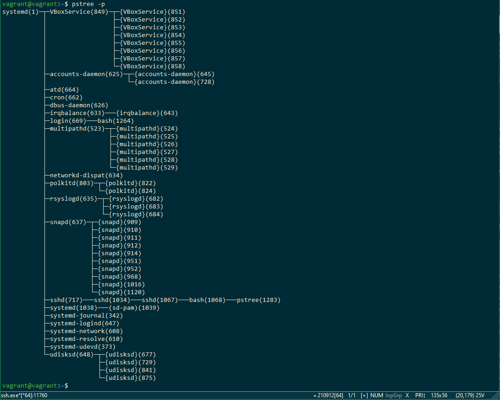
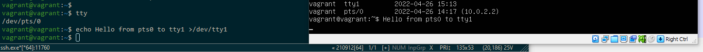
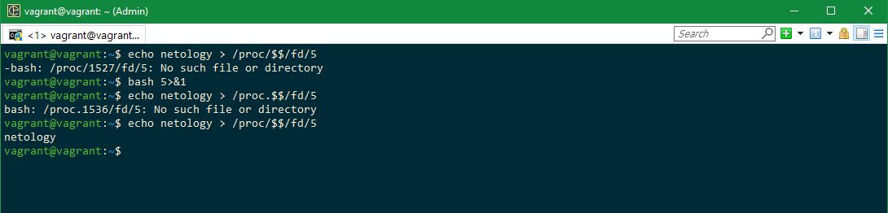
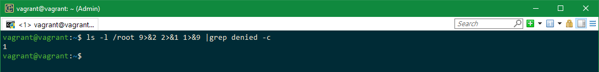
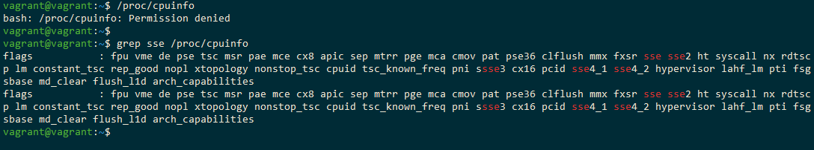
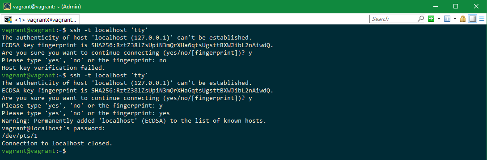

## Домашнее задание 3.2
1. Какого типа команда `cd`? Попробуйте объяснить, почему она именно такого типа; опишите ход своих мыслей, если считаете что она могла бы быть другого типа.  
    Ответ: Это команда встроенная, потому что, работая внутри сессии терминала логичнее менять указатель на текущую директорию внутренней функцией. 
Если использовать внешний вызов, то он будет работать со своим окружением, и менять текущий каталог внутри своего окружения, а на вызвавший shell влиять не будет.  
Теоретически можно сделать `cd` внешней программой, но после смены директории необходимо вызвать bash из этого каталога, но тогда мы получим новый shell.
И выходя из сессии, придется выходить из всех сессий, которые создали при каждом вызове внешней `cd`.
2. Какая альтернатива без pipe команде `grep <some_string> <some_file> | wc -l`? `man grep` поможет в ответе на этот вопрос. Ознакомьтесь с [документом](http://www.smallo.ruhr.de/award.html) о других подобных некорректных вариантах использования pipe.  
    Ответ:
~~vagrant@vagrant:~$ cat tst_bash
if [[ -d /tmp ]];  
jfgnhj  
hkgjhkldt  
123  
vagrant@vagrant:~$ grep 123 tst_bash -c  
1  
vagrant@vagrant:~$ grep 123 tst_bash | wc -l  
1~~  
3. Какой процесс с PID 1 является родителем для всех процессов в вашей виртуальной машине Ubuntu 20.04?  
Ответ:  

4. Как будет выглядеть команда, которая перенаправит вывод stderr `ls` на другую сессию терминала?  
    Ответ:  
  
5. Получится ли одновременно передать команде файл на stdin и вывести ее stdout в другой файл? Приведите работающий пример.  
    Ответ:  
vagrant@vagrant:~$ cat tst_bash  
if [[ -d /tmp ]];  
sdgsdfgfd  
sdgsdfgfghdgfd  
123  
new line  
11111111  
vagrant@vagrant:~$ cat tst_bash_out  
cat: tst_bash_out: No such file or directory   
vagrant@vagrant:~$ cat <tst_bash >tst_bash_out  
vagrant@vagrant:~$ cat tst_bash_out  
if [[ -d /tmp ]];  
sdgsdfgfd  
sdgsdfgfghdgfd  
123  
new line  
11111111  
vagrant@vagrant:~$  
6. Получится ли находясь в графическом режиме, вывести данные из PTY в какой-либо из эмуляторов TTY? Сможете ли вы наблюдать выводимые данные?  
    Ответ:  
  
7. Выполните команду bash 5>&1. К чему она приведет? Что будет, если вы выполните echo netology > /proc/$$/fd/5? Почему так происходит?  
    Ответ:  
bash 5>&1 - создаст дескриптор с 5 и перенаправит его в stdout  
echo netology > /proc/$$/fd/5 - выведет в дескриптор "5", который был перенаправлен в stdout  
если запустить echo netology > /proc/$$/fd/5 в новой сесcии, получим ошибку, т.к. такого дескриптора нет  
  
8. Получится ли в качестве входного потока для pipe использовать только stderr команды, не потеряв при этом отображение stdout на pty? Напоминаем: по умолчанию через pipe передается только stdout команды слева от | на stdin команды справа. Это можно сделать, поменяв стандартные потоки местами через промежуточный новый дескриптор, который вы научились создавать в предыдущем вопросе.  
    Ответ:  

9>&2 - новый дескриптор перенаправили в stderr  
2>&1 - stderr перенаправили в stdout  
1>&9 - stdout - перенаправили в новый дескриптор  
9. Что выведет команда `cat /proc/$$/environ`? Как еще можно получить аналогичный по содержанию вывод?  
    Ответ:  
Будут выведены переменные окружения.  
Можно получить тоже самое с разделением по переменным по строкам:  
printenv  
env  
10. Используя `man`, опишите что доступно по адресам `/proc/<PID>/cmdline`, `/proc/<PID>/exe`.  
    Ответ:  
`/proc/<PID>/cmdline` - полный путь до исполняемого файла процесса [PID]  
`/proc/<PID>/exe` - содержит ссылку до файла запущенного для процесса [PID], cat выведет содержимое запущенного файла, запуск этого файла, запустит еще одну копию самого файла.  
11. Узнайте, какую наиболее старшую версию набора инструкций SSE поддерживает ваш процессор с помощью `/proc/cpuinfo`.  
    Ответ:  
SSE 4.2  
grep sse /proc/cpuinfo  
  
12. При открытии нового окна терминала и `vagrant ssh` создается новая сессия и выделяется pty. Это можно подтвердить командой `tty`, которая упоминалась в лекции 3.2. Однако:
```
vagrant@netology1:~$ ssh localhost 'tty'
not a tty
```
Почитайте, почему так происходит, и как изменить поведение.  
    Ответ:  
При подключении ожидается пользователь, а не процесс, и нет локального tty. Для запуска можно добавить -t, и команда исполняется с принудительным созданием псевдотерминала.  
  
13. Бывает, что есть необходимость переместить запущенный процесс из одной сессии в другую. Попробуйте сделать это, воспользовавшись `reptyr`. Например, так можно перенести в `screen` процесс, который вы запустили по ошибке в обычной SSH-сессии.  
    Ответ:  
После установки значения kernel.yama.ptrace_scope = 0 перестал ругаться на права, после чего процесс был перехвачен в screen, и продолжил работу после закрытия терминала.  
В pstree процесс отображался в виде reptyr.  
14. `sudo echo string > /root/new_file` не даст выполнить перенаправление под обычным пользователем, так как перенаправлением занимается процесс shell'а, который запущен без `sudo` под вашим пользователем. Для решения данной проблемы можно использовать конструкцию `echo string | sudo tee /root/new_file`. Узнайте что делает команда `tee` и почему в отличие от `sudo echo` команда с `sudo tee` будет работать.  
    Ответ:  
Команда `tee` делает вывод одновременно и в файл, указанный в качестве параметра, и в stdout. В данном примере команда получает вывод из stdin, перенаправленный через pipe от stdout команды `echo` и, т.к. команда запущена от `sudo`, соответственно имеет права на запись.  
