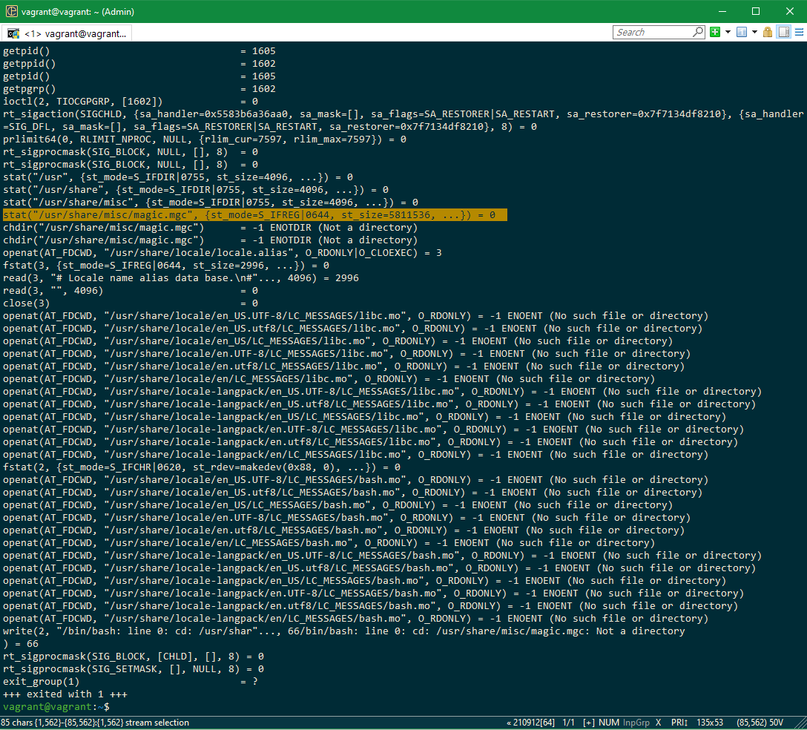

## Домашнее задание 3.3 "Операционные системы, лекция 1"  

1. Какой системный вызов делает команда `cd`? В прошлом ДЗ мы выяснили, что `cd` не является самостоятельной программой, это `shell builtin`, поэтому запустить `strace` непосредственно на `cd` не получится. Тем не менее, вы можете запустить `strace` на `/bin/bash -c 'cd /tmp'`. В этом случае вы увидите полный список системных вызовов, которые делает сам `bash` при старте. Вам нужно найти тот единственный, который относится именно к `cd`. Обратите внимание, что `strace` выдаёт результат своей работы в поток stderr, а не в stdout.  
    Ответ:  
CD -> chdir("/tmp")  
  
2. Попробуйте использовать команду `file` на объекты разных типов на файловой системе. Например:  
    ``````
    vagrant@netology1:~$ file /dev/tty
    /dev/tty: character special (5/0)
    vagrant@netology1:~$ file /dev/sda
    /dev/sda: block special (8/0)
    vagrant@netology1:~$ file /bin/bash
    /bin/bash: ELF 64-bit LSB shared object, x86-64  
    ``````
    Используя `strace` выясните, где находится база данных `file` на основании которой она делает свои догадки.  
   Ответ:  
Файл базы - /usr/share/misc/magic.mgc   
  
3. Предположим, приложение пишет лог в текстовый файл. Этот файл оказался удален (deleted в lsof), однако возможности сигналом сказать приложению переоткрыть файлы или просто перезапустить приложение – нет. Так как приложение продолжает писать в удаленный файл, место на диске постепенно заканчивается. Основываясь на знаниях о перенаправлении потоков предложите способ обнуления открытого удаленного файла (чтобы освободить место на файловой системе).  
    Ответ:  
На примере редактора vi  
  
4. Занимают ли зомби-процессы какие-то ресурсы в ОС (CPU, RAM, IO)?  
    Ответ:  
Зомби-процессы освобождают свои ресурсы, но не освобождают запись в таблице процессов. Запись освобождается при вызове родительским процессом.  
5. В iovisor BCC есть утилита `opensnoop`:  
```
root@vagrant:~# dpkg -L bpfcc-tools | grep sbin/opensnoop
/usr/sbin/opensnoop-bpfcc
```
На какие файлы вы увидели вызовы группы `open` за первую секунду работы утилиты? Воспользуйтесь пакетом `bpfcc-tools` для Ubuntu 20.04. Дополнительные [сведения по установке](https://github.com/iovisor/bcc/blob/master/INSTALL.md).  
    Ответ:  
Без root не запустилась  
  
6. Какой системный вызов использует `uname -a`? Приведите цитату из man по этому системному вызову, где описывается альтернативное местоположение в `/proc`, где можно узнать версию ядра и релиз ОС.  
    Ответ:  
  
  
7. Чем отличается последовательность команд через `;` и через `&&` в bash? Например:  
```
root@netology1:~# test -d /tmp/some_dir; echo Hi
Hi
root@netology1:~# test -d /tmp/some_dir && echo Hi
root@netology1:~#
```  
Есть ли смысл использовать в bash `&&`, если применить `set -e`?  
    Ответ:  
`;`  - разделитель последовательных команд  
`&&` - условный оператор  
`test -d /tmp/dir && echo 123` - `echo` отработает только при успешном завершении `test`

`set -e` - прерывает сессию при любом ненулевом значении исполняемых команд в конвейере, кроме последней. `&&` вместе с `set -e` при ошибке выполнение команд прекратиться.  
8. Из каких опций состоит режим bash `set -euxo pipefail` и почему его хорошо было бы использовать в сценариях?  
    Ответ:  
-e прерывает выполнение исполнения при ошибке любой команды кроме последней в последовательности  
-x вывод трейса простых команд  
-u неустановленные/незаданные параметры и переменные считаются как ошибки, с выводом в stderr текста ошибки и выполнит завершение неинтерактивного вызова   
-o pipefail возвращает код возврата набора/последовательности команд, ненулевой при последней команды или 0 для успешного выполнения команд.  
Повышает детализацию логирования и завершит сценарий при наличии ошибок, кроме последней завершающей команды.  
9. Используя `-o stat` для `ps`, определите, какой наиболее часто встречающийся статус у процессов в системе. В `man ps` ознакомьтесь (`/PROCESS STATE CODES`) что значат дополнительные к основной заглавной буквы статуса процессов. Его можно не учитывать при расчете (считать S, Ss или Ssl равнозначными).  
    Ответ:  
S*(S,S+,Ss,Ssl,Ss+) - процессы ожидающие завершения (спящие)  
I*(I,I<) - фоновые (бездействующие) процессы ядра  
Дополнительные символы - это доп характеристики, например приоритет.  
  


