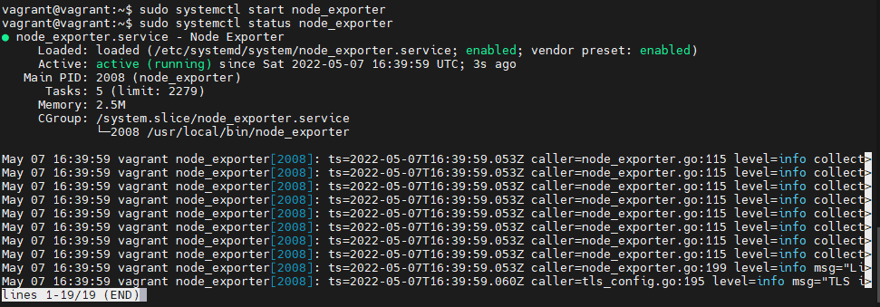
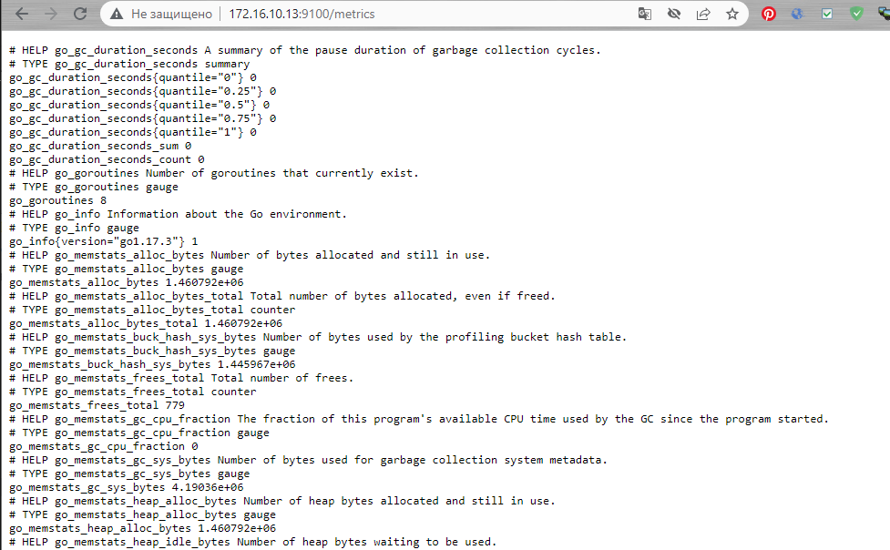
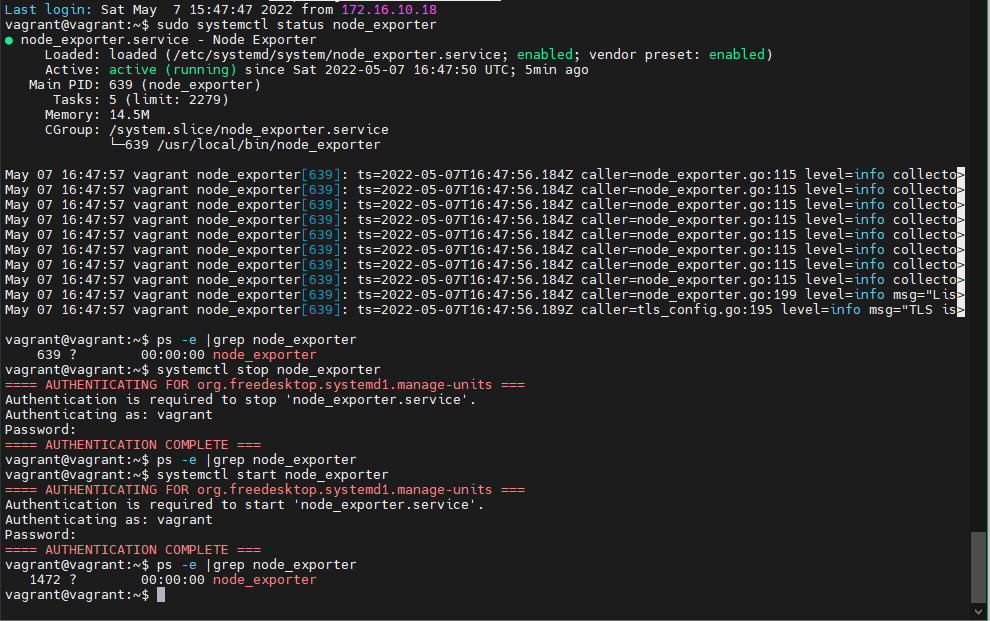
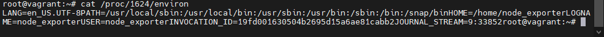
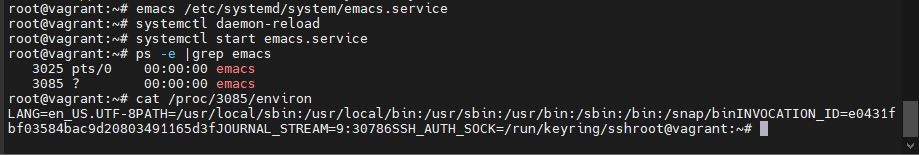
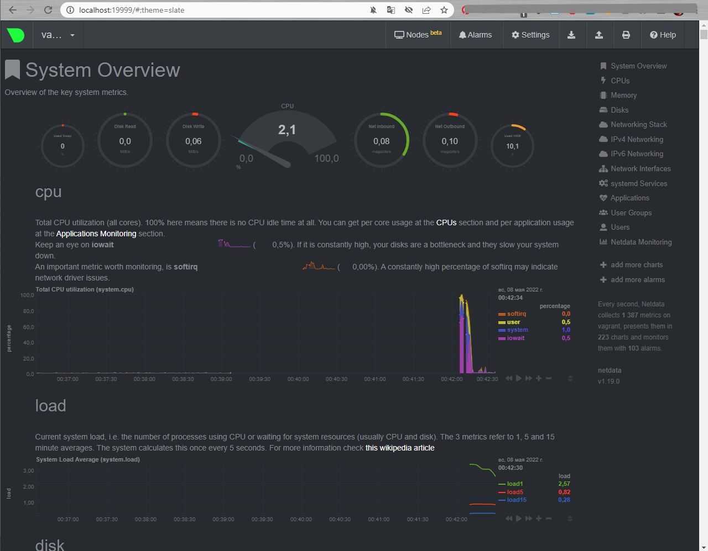
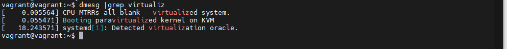
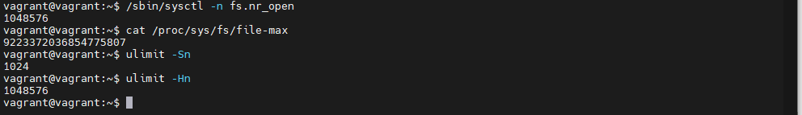

## Домашнее задание 3.4 "Операционные системы, лекция 2"  

1. На лекции мы познакомились с [node_exporter](https://github.com/prometheus/node_exporter/releases). В демонстрации его исполняемый файл запускался в background. Этого достаточно для демо, но не для настоящей production-системы, где процессы должны находиться под внешним управлением. Используя знания из лекции по systemd, создайте самостоятельно простой [unit-файл](https://www.freedesktop.org/software/systemd/man/systemd.service.html) для node_exporter:

    * поместите его в автозагрузку,
    * предусмотрите возможность добавления опций к запускаемому процессу через внешний файл (посмотрите, например, на `systemctl cat cron`),
    * удостоверьтесь, что с помощью systemctl процесс корректно стартует, завершается, а после перезагрузки автоматически поднимается.  

    Ответ:  
   Установлено, порт  9100 проброшен
   
     

   Сервис стартует и перезапускается корректно  

     

Прописан конфигурационный файл:  

[Unit]  
Description=Node Exporter  
 
[Service]  
ExecStart=/opt/node_exporter/node_exporter  
EnvironmentFile=/etc/default/node_exporter  
 
[Install]  
WantedBy=default.target  
при перезапуске переменная выставляется: 
     

**Доработка**  
На примере текстового редактора Emacs  
Конфигурационный файл:  
```  
[Unit]
Description=Emacs: the extensible, self-documenting text editor
 
[Service]
Type=forking
ExecStart=/usr/bin/emacs --daemon
ExecStop=/usr/bin/emacsclient --eval "(kill-emacs)"
Environment=SSH_AUTH_SOCK=%t/keyring/ssh
Restart=always
 
[Install]
WantedBy=default.target
```  
Исполняемый файл `/usr/bin/emacs` запускается как демон при запуске службы. Переменная среды SSH_AUTH_SOCK задается с помощью спецификатора “%t”, который stands for the runtime directory. Сервис также перезапускает процесс emacs, если он неожиданно завершает работу.  
  

2. Ознакомьтесь с опциями node_exporter и выводом `/metrics` по-умолчанию. Приведите несколько опций, которые вы бы выбрали для базового мониторинга хоста по CPU, памяти, диску и сети.  
   Ответ:  
CPU:  
    node_cpu_seconds_total{cpu="0",mode="idle"} 2028.69  
    node_cpu_seconds_total{cpu="0",mode="system"} 18.77  
    node_cpu_seconds_total{cpu="0",mode="user"} 5.96  
    process_cpu_seconds_total  
Memory:  
    node_memory_MemAvailable_bytes   
    node_memory_MemFree_bytes  
Disk:  
    node_disk_io_time_seconds_total{device="sda"}  
    node_disk_read_bytes_total{device="sda"}  
    node_disk_read_time_seconds_total{device="sda"}  
    node_disk_write_time_seconds_total{device="sda"}  
Network:  
    node_network_receive_errs_total{device="eth0"}   
    node_network_receive_bytes_total{device="eth0"}   
    node_network_transmit_bytes_total{device="eth0"}  
    node_network_transmit_errs_total{device="eth0"}  
3. Установите в свою виртуальную машину [Netdata](https://github.com/netdata/netdata). Воспользуйтесь [готовыми пакетами](https://packagecloud.io/netdata/netdata/install) для установки (`sudo apt install -y netdata`). После успешной установки:
    * в конфигурационном файле `/etc/netdata/netdata.conf` в секции [web] замените значение с localhost на `bind to = 0.0.0.0`,
    * добавьте в Vagrantfile проброс порта Netdata на свой локальный компьютер и сделайте `vagrant reload`:

    ```bash
    config.vm.network "forwarded_port", guest: 19999, host: 19999
    ```
После успешной перезагрузки в браузере *на своем ПК* (не в виртуальной машине) вы должны суметь зайти на `localhost:19999`. Ознакомьтесь с метриками, которые по умолчанию собираются Netdata и с комментариями, которые даны к этим метрикам.  
   Ответ:  
  
4. Можно ли по выводу `dmesg` понять, осознает ли ОС, что загружена не на настоящем оборудовании, а на системе виртуализации?  
   Ответ:  
Можно, причем даже тип ВМ
  
В системах загруженных на реальном железе, будет "... Booting paravirtualized kernel on bare hardware"  
5. Как настроен sysctl `fs.nr_open` на системе по-умолчанию? Узнайте, что означает этот параметр. Какой другой существующий лимит не позволит достичь такого числа (`ulimit --help`)?  
   Ответ:  
   * /sbin/sysctl -n fs.nr_open - максимальное число открытых дескрипторов для ядра. Число задается кратное 1024.  
   * cat /proc/sys/fs/file-max - максимальный предел ОС  
   * ulimit -Sn - мягкий лимит (так же ulimit -n)на пользователя, может быть увеличен в процессе работы  
   * ulimit -Hn - жесткий лимит на пользователя (не может быть увеличен, только уменьшен)  
   Оба ulimit -n НЕ могут превысить системный fs.nr_open
  
6. Запустите любой долгоживущий процесс (не `ls`, который отработает мгновенно, а, например, `sleep 1h`) в отдельном неймспейсе процессов; покажите, что ваш процесс работает под PID 1 через `nsenter`. Для простоты работайте в данном задании под root (`sudo -i`). Под обычным пользователем требуются дополнительные опции (`--map-root-user`) и т.д.  
   Ответ: 
```
root@vagrant:~# ps -e |grep sleep  
   1920 pts/2    00:00:00 sleep  
root@vagrant:~# nsenter --target 1920 --pid --mount  
root@vagrant:/# ps  
    PID TTY          TIME CMD  
      2 pts/0    00:00:00 bash  
     11 pts/0    00:00:00 ps  
```  
7. Найдите информацию о том, что такое `:(){ :|:& };:`. Запустите эту команду в своей виртуальной машине Vagrant с Ubuntu 20.04 (**это важно, поведение в других ОС не проверялось**). Некоторое время все будет "плохо", после чего (минуты) – ОС должна стабилизироваться. Вызов `dmesg` расскажет, какой механизм помог автоматической стабилизации. Как настроен этот механизм по-умолчанию, и как изменить число процессов, которое можно создать в сессии?  
   Ответ:  
Это функция внутри "{}", с именем ":", которая после определения в строке запускает саму себя. Порождает два фоновых процесса самой себя, получается вроде бинарного дерева, плодящее процессы.    
Функционал видимо этот:  
[ 3179.967220] cgroup: fork rejected by pids controller in /user.slice/user-1000.slice/session-4.scope  
[ 3206.111318] cgroup: fork rejected by pids controller in /user.slice/user-1000.slice/session-11.scope  

Система на основании этих файлов в пользовательской зоне ресурсов имеет определенное ограничение на создаваемые ресурсы и при превышении начинает блокировать создание.  
Если установить ulimit -u 40 - число процессов для пользователя будет ограниченно 40. 


