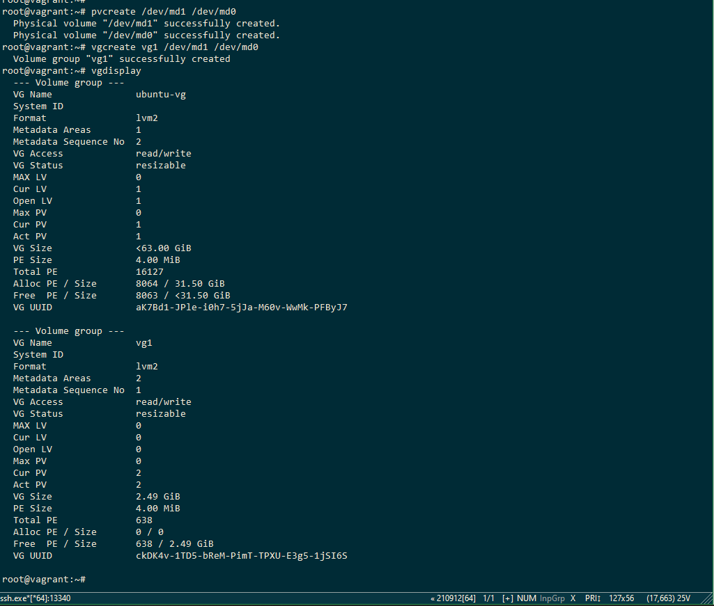

## Домашнее задание к занятию "3.5. Файловые системы"  

1. Узнайте о [sparse](https://ru.wikipedia.org/wiki/%D0%A0%D0%B0%D0%B7%D1%80%D0%B5%D0%B6%D1%91%D0%BD%D0%BD%D1%8B%D0%B9_%D1%84%D0%B0%D0%B9%D0%BB) (разряженных) файлах.  
    Ответ:  
Разрежённые файлы используются для хранения контейнеров, например:
* образов дисков виртуальных машин;  
* резервных копий дисков и/или разделов, созданных спец. ПО.  

2. Могут ли файлы, являющиеся жесткой ссылкой на один объект, иметь разные права доступа и владельца? Почему?  
    Ответ:  
Так как hardlink это ссылка на тот же самый файл и имеет тот же inode то права будут одни и теже.  
  
3. Сделайте `vagrant destroy` на имеющийся инстанс Ubuntu. Замените содержимое Vagrantfile следующим:

    ```bash
    Vagrant.configure("2") do |config|
      config.vm.box = "bento/ubuntu-20.04"
      config.vm.provider :virtualbox do |vb|
        lvm_experiments_disk0_path = "/tmp/lvm_experiments_disk0.vmdk"
        lvm_experiments_disk1_path = "/tmp/lvm_experiments_disk1.vmdk"
        vb.customize ['createmedium', '--filename', lvm_experiments_disk0_path, '--size', 2560]
        vb.customize ['createmedium', '--filename', lvm_experiments_disk1_path, '--size', 2560]
        vb.customize ['storageattach', :id, '--storagectl', 'SATA Controller', '--port', 1, '--device', 0, '--type', 'hdd', '--medium', lvm_experiments_disk0_path]
        vb.customize ['storageattach', :id, '--storagectl', 'SATA Controller', '--port', 2, '--device', 0, '--type', 'hdd', '--medium', lvm_experiments_disk1_path]
      end
    end
    ```
    Данная конфигурация создаст новую виртуальную машину с двумя дополнительными неразмеченными дисками по 2.5 Гб.  
    Ответ:  
  
4. Используя `fdisk`, разбейте первый диск на 2 раздела: 2 Гб, оставшееся пространство.  
    Ответ:  
  
5. Используя `sfdisk`, перенесите данную таблицу разделов на второй диск.  
    Ответ:  
  
6. Соберите `mdadm` RAID1 на паре разделов 2 Гб.  
    Ответ:  
  
7. Соберите `mdadm` RAID0 на второй паре маленьких разделов.  
    Ответ:  
  
8. Создайте 2 независимых PV на получившихся md-устройствах.  
    Ответ:  
  
9. Создайте общую volume-group на этих двух PV.  
    Ответ:  
  
10. Создайте LV размером 100 Мб, указав его расположение на PV с RAID0.  
    Ответ:  
  
11. Создайте `mkfs.ext4` ФС на получившемся LV.  
    Ответ:  
  
12. Смонтируйте этот раздел в любую директорию, например, `/tmp/new`.  
    Ответ:  
  
13. Поместите туда тестовый файл, например `wget https://mirror.yandex.ru/ubuntu/ls-lR.gz -O /tmp/new/test.gz`.  
    Ответ:  
  
14. Прикрепите вывод `lsblk`.  
    Ответ:  
  
15. Протестируйте целостность файла:  
    ```bash
    root@vagrant:~# gzip -t /tmp/new/test.gz
    root@vagrant:~# echo $?
    0
    ```  
    Ответ:  
  
16. Используя pvmove, переместите содержимое PV с RAID0 на RAID1.  
    Ответ:  
  
17. Сделайте `--fail` на устройство в вашем RAID1 md.  
    Ответ:  
  
18. Подтвердите выводом `dmesg`, что RAID1 работает в деградированном состоянии.  
    Ответ:  
  
19. Протестируйте целостность файла, несмотря на "сбойный" диск он должен продолжать быть доступен:  
    ```bash
    root@vagrant:~# gzip -t /tmp/new/test.gz
    root@vagrant:~# echo $?
    0
    ```  
    Ответ:  
  
20. Погасите тестовый хост, `vagrant destroy`.  
    Ответ:  
  


