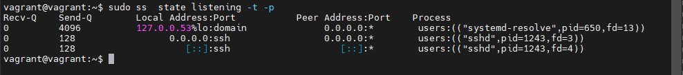
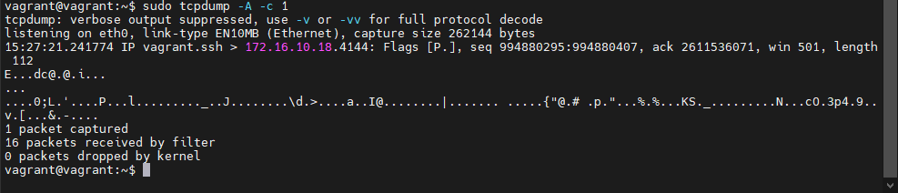
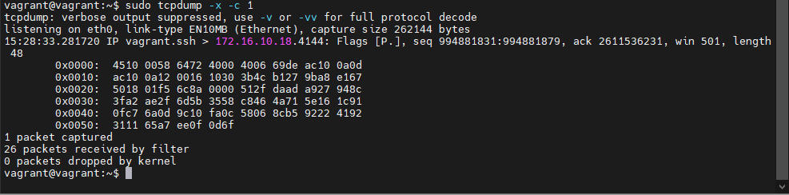

## Домашнее задание к занятию "3.6. Компьютерные сети, лекция 1"  

1. Необязательное задание:
можно посмотреть целый фильм в консоли `telnet towel.blinkenlights.nl` :)  
    **Ответ:**  
Текстовые Star Wars - это круто! )))  

2. Узнайте о том, сколько действительно независимых (не пересекающихся) каналов есть в разделяемой среде WiFi при работе на 2.4 ГГц. Стандарты с полосой 5 ГГц более актуальны, но регламенты на 5 ГГц существенно различаются в разных странах, а так же не раз обновлялись. В качестве дополнительного вопроса вне зачета, попробуйте найти актуальный ответ и на этот вопрос.  
    **Ответ:**  
**2.4GHz**  
Всего 14 каналов, с учетом того, что в стандарте предусмотрена разная ширина канала: 10, 20, 22, 40, 80 и 160 МГц, основные 20 и 40 используются при ширине канала 40 МГц, всего 3 непересекающихся канала: 1,6,11. Каналы шириной 80 и 160 МГц в диапазон 2.4 ГГц, не имеют не пересекающихся каналов.  
**5GHz**  
В разных странах разрешенные разные. По разрешенные каналы в РФ:  
20Мгц - 17 каналов  
40Мгц - 8 каналов  
80Мгц - 4 каналов  
160Мгц - 1 каналов  
Соответственно, если в сети работает хотя бы одно устройство на 160МГц, то больше каналов нет.  

3. Адрес канального уровня – MAC адрес – это 6 байт, первые 3 из которых называются OUI – Organizationally Unique Identifier или уникальный идентификатор организации. Какому производителю принадлежит MAC `38:f9:d3:55:55:79`?
    **Ответ:**  
Для MAC `38:f9:d3:55:55:79` найдена следующая информация:  
    Apple, Inc.  
    1 Infinite Loop  
    Cupertino  CA  95014  
    US  

4. Каким будет payload TCP сегмента, если Ethernet MTU задан в 9001 байт, размер заголовков IPv4 – 20 байт, а TCP – 32 байта?
    **Ответ:**  
TCP Segment = 8981 (MTU - Ethernet Header)  

5. Может ли во флагах TCP одновременно быть установлены флаги SYN и FIN при штатном режиме работы сети? Почему да или нет?  
    **Ответ:**  
При штатной работе сети НЕ могут, так как SYN - начинает соединение, а FIN завершает. Одним пакетом нельзя одновременно и открыть и закрыть сессию.  

6. `ss -ula sport = :53` на хосте имеет следующий вывод:  

```bash
State           Recv-Q          Send-Q                   Local Address:Port                     Peer Address:Port          Process
UNCONN          0               0                        127.0.0.53%lo:domain                        0.0.0.0:*
```

Почему в `State` присутствует только `UNCONN`, и может ли там присутствовать, например, `TIME-WAIT`?  
    **Ответ:**  
UNCONN - соединение не установлено,  
Time-wait - это состояние когда сокет отправил подтверждение о получении завершения соединение и ждет, что сообщение доставлено.    
-u говорит нам про вывод UDP порта, для разрыва соединения ему не нужно ждать завершения сессии.  

7. Обладая знаниями о том, как штатным образом завершается соединение (FIN от инициатора, FIN-ACK от ответчика, ACK от инициатора), опишите в каких состояниях будет находиться TCP соединение в каждый момент времени на клиенте и на сервере при завершении. Схема переходов состояния соединения вам в этом поможет.  
**Ответ:**  
```
                    Client           Server   
                 ESTABLESHED      ESTABLESHED  
8. >> FIN        FIN WAIT 1   >   CLOSE WAIT  
9. << FIN-ACC    FIN WAIT 2   >   CLOSE WAIT  
10. >> ACK        TIME WAIT    <   LAST ACK  
                  CLOSED       >   CLOSED  
```  

8. TCP порт – 16 битное число. Предположим, 2 находящихся в одной сети хоста устанавливают между собой соединения. Каким будет теоретическое максимальное число соединений, ограниченное только лишь параметрами L4, которое параллельно может установить клиент с одного IP адреса к серверу с одним IP адресом? Сколько соединений сможет обслужить сервер от одного клиента? А если клиентов больше одного?  
    **Ответ:**  
Максимальное число портов = 65535 (16 бит)  
В теории максимальное число соединений от одного клиента для сервера может быть = 65535   
В теории может быть открыт 1 порт на каждого клиента и слушать 65535 соединений клиента  
Уникальными должна быть пара SERVER_IP:PORT - Client_IP:PORT  

9. Может ли сложиться ситуация, при которой большое число соединений TCP на хосте находятся в состоянии  `TIME-WAIT`? Если да, то является ли она хорошей или плохой? Подкрепите свой ответ пояснением той или иной оценки.  
    **Ответ:**  
Да может, при частом соединении и отсоединении.  
При частом соединении и отключении создается соединение и выделяется каждый раз порт, предыдущая сессия какое-то время находится в "ожидании", новая сессия может начаться раньше чем будет закрыта предыдущая.  
При большом числе соединений это может вызвать накопление соединение и расход соответствующих ресурсов.  
А если все соединения идут к одной службе, то может так же возникнуть ситуация когда кончаться порты.  

10. Чем особенно плоха фрагментация UDP относительно фрагментации TCP?  
    **Ответ:**  
Если один из фрагментов не дойдет, то необходимо перепослать весь пакет заново, но в UDP нет контроля ошибок, и как следствие информация не дойдет.  
Например в SIP сетях, когда при большой загрузке могут не проходить звонки, так как фрагменты больших пакетов теряются и данные не доходят. Так же может возникать проблема, когда переполняется буфер фрагментов на сетевом оборудовании, что приводит к "подвисанию" всей сети.  

11. Если бы вы строили систему удаленного сбора логов, то есть систему, в которой несколько хостов отправляют на центральный узел генерируемые приложениями логи (предположим, что логи – текстовая информация), какой протокол транспортного уровня вы выбрали бы и почему? Проверьте ваше предположение самостоятельно, узнав о стандартном протоколе syslog.  
    **Ответ:**  
Первоначально syslog использовал UDP, но в следующей редакции использовался TCP.  
Я бы использовал TCP, так как есть механизм гарантированной доставки пакетов, чего нет в UDP, а для логов это очень важно.  

12. Сколько портов TCP находится в состоянии прослушивания на вашей виртуальной машине с Ubuntu, и каким процессам они принадлежат?  
    **Ответ:**  
  

13. Какой ключ нужно добавить в `tcpdump`, чтобы он начал выводить не только заголовки, но и содержимое фреймов в текстовом виде? А в текстовом и шестнадцатиричном?  
    **Ответ:**  
tcpdump -x - выведет содержимое пакетов в hex  
  
tcpdump -XX - выведет содержимое пакетов в hex  
  

14. Попробуйте собрать дамп трафика с помощью `tcpdump` на основном интерфейсе вашей виртуальной машины и посмотреть его через tshark или Wireshark (можно ограничить число пакетов `-c 100`). Встретились ли вам какие-то установленные флаги Internet Protocol (не флаги TCP, а флаги IP)? Узнайте, какие флаги бывают. Как на самом деле называется стандарт Ethernet, фреймы которого попали в ваш дамп? Можно ли где-то в дампе увидеть OUI?  
    **Ответ:**  
ВМ долго генерит соответствующий трафик, поэтому собирал с хостовой машины.  

Есть флаги IP: Don't fragment (второй бит 0 1 0),  
Всего 3 бита:  
    0 - зарезервировано, всегда 0  
    1 - указывает на фрагментирование, 0 - разрешена фрагментация, 1 - нет
    2 - указывает на конец фрагментированных пакетов, 1 - не последний фрагмент  
В дампе OUI можно увидеть в заголовке Ethernet пакета в виде короткого имени и ID (часть MACа).  


