## Домашнее задание к занятию "3.6. Компьютерные сети, лекция 1"  
 
1. Работа c HTTP через телнет. 
* Подключитесь утилитой телнет к сайту stackoverflow.com `telnet stackoverflow.com 80`  
* отправьте HTTP запрос  
```
GET /questions HTTP/1.0
HOST: stackoverflow.com
[press enter]
[press enter]
```
* В ответе укажите полученный HTTP код, что он означает?  
Ответ:   
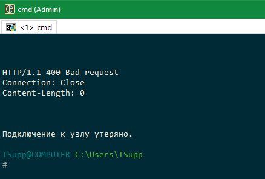  
Ошибка 400 Bad Request – это код ответа HTTP, который означает, что сервер не смог обработать запрос, отправленный клиентом из-за неверного синтаксиса.  
**Доработка**  
Попробовал, на разных компьютерах ответ тот же. После ввода `telnet stackoverflow.com 80` висит пустой экран, ничего ввести не дает, после двойного Enter или по таймауту ошибка 400.  

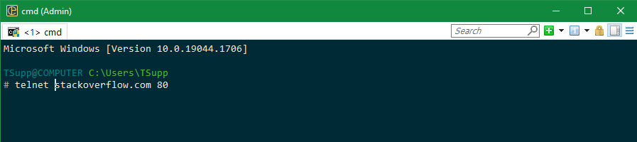  
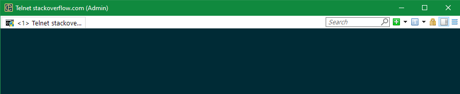  
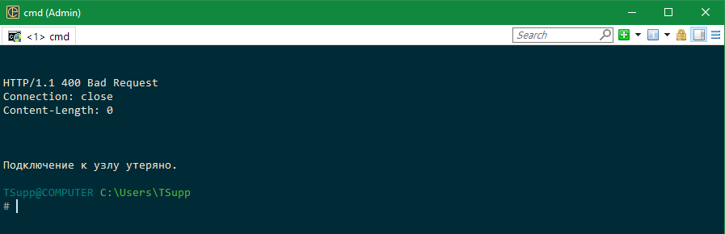  

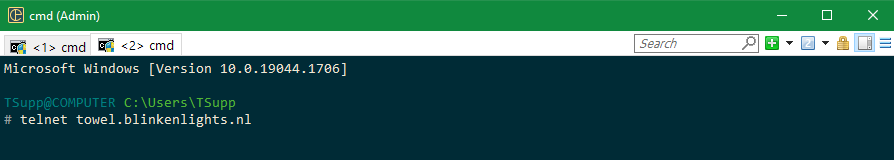  
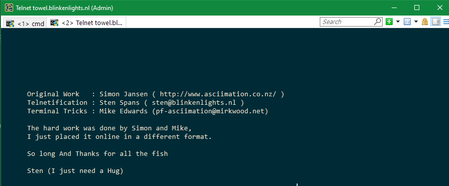  
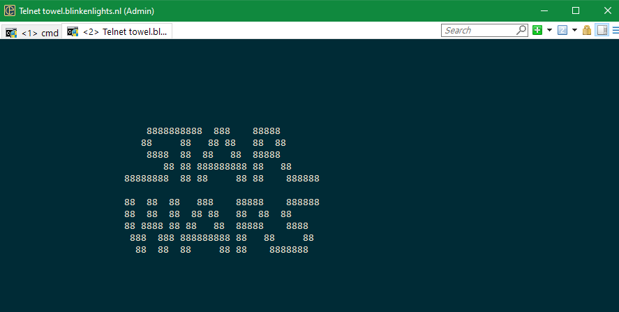  

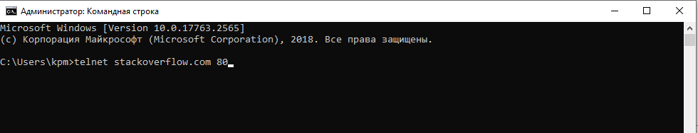  
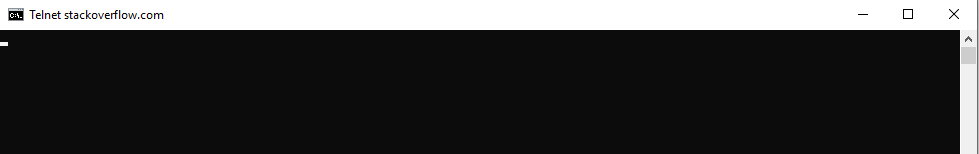  
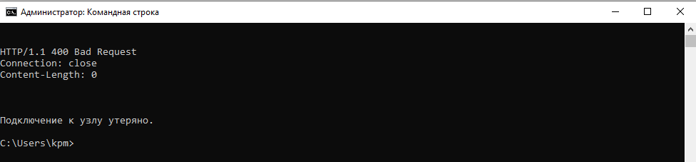  

Для примера попробовал на `telnet mail.ru 80`  
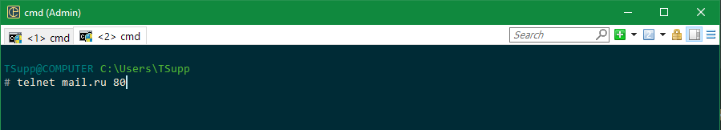  
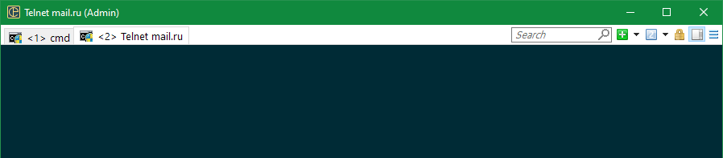  
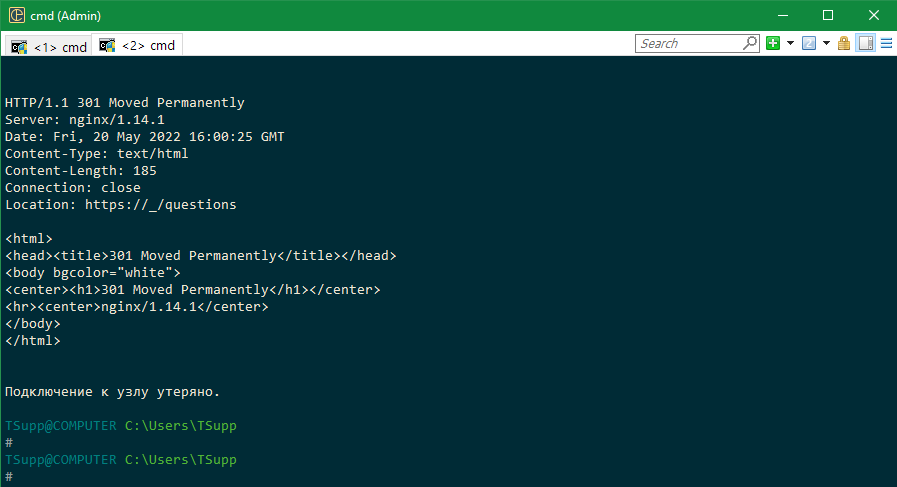  

При этом на компьютерах telnet`ом я пользуюсь часто по работе, все работает без сбоев. Для примера скрины подключения к сетевому коммутатору и одному из корпоративных серверов  
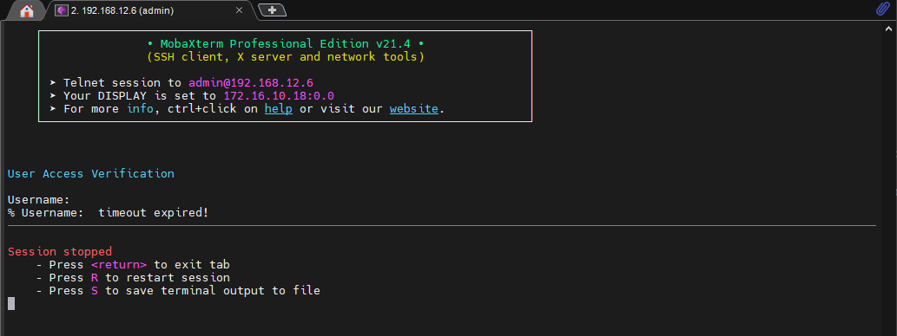  
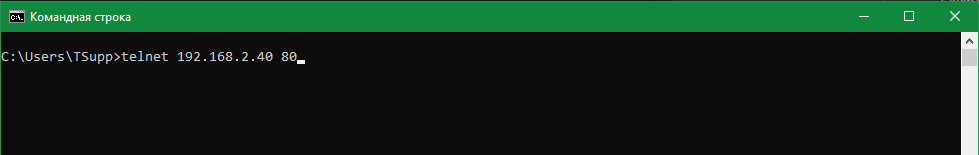  
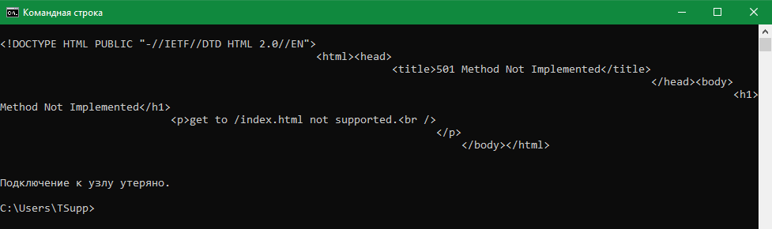  

3. Повторите задание 1 в браузере, используя консоль разработчика F12.  
* откройте вкладку `Network`  
* отправьте запрос http://stackoverflow.com  
* найдите первый ответ HTTP сервера, откройте вкладку `Headers`  
* укажите в ответе полученный HTTP код.  
* проверьте время загрузки страницы, какой запрос обрабатывался дольше всего?  
* приложите скриншот консоли браузера в ответ.  
    Ответ:  
200 OK — успешный запрос. Если клиентом были запрошены какие-либо данные, то они находятся в заголовке и/или теле сообщения.  
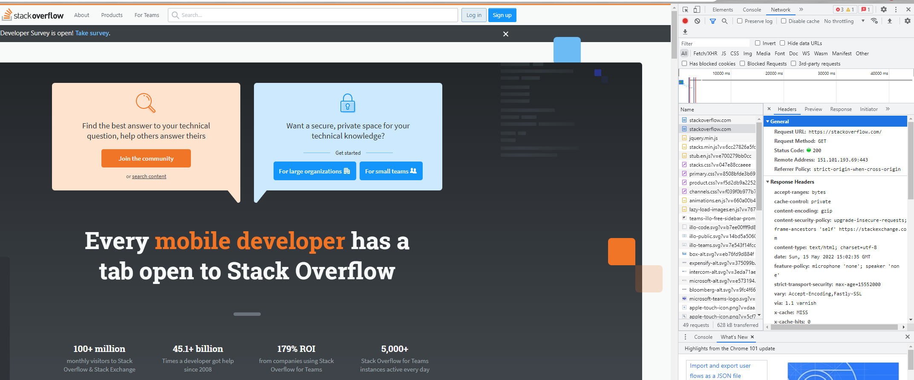  

Судя по скрину, один скрипт не выполнился(полагаю из-за блокировщика рекламы), а дольше всего выполнялась пара скриптов  
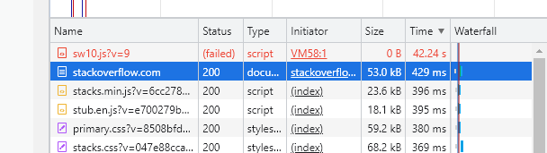  

**Доработка ответа:**  
Все повторил - результат тот же. Влияют на результат настроенные на компьютере в браузере по умолчанию (Chrome) блокировщики (антиреклама, запрет некоторых куки, аналитика и т.д), т.к. запуская сайт на "чистых" браузерах, например EDGE или инкогнито тот же Chrome, все работает "нормально".  
**проверка Chrome по умолчанию**
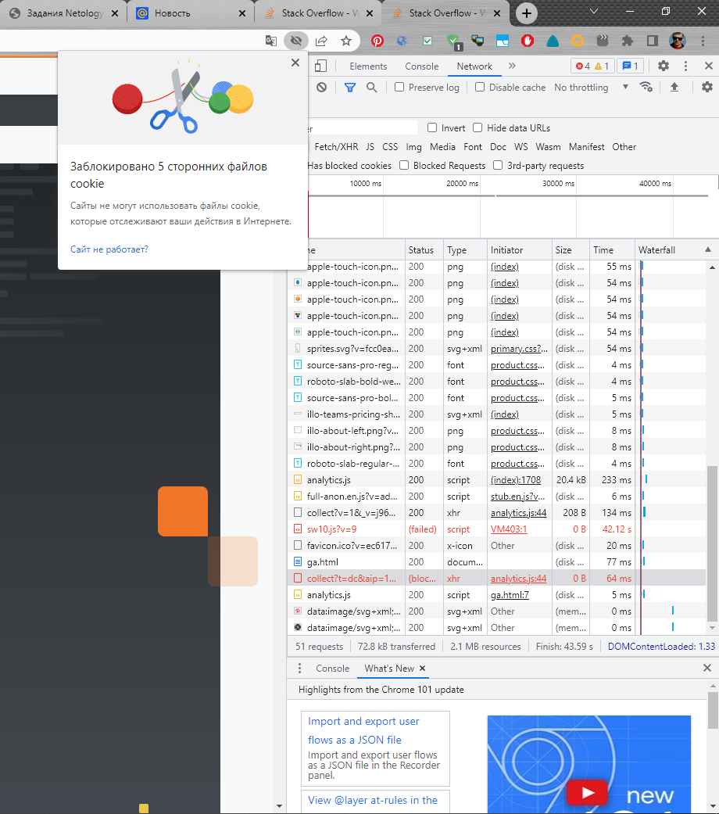  
**проверка Chrome инкогнито**  
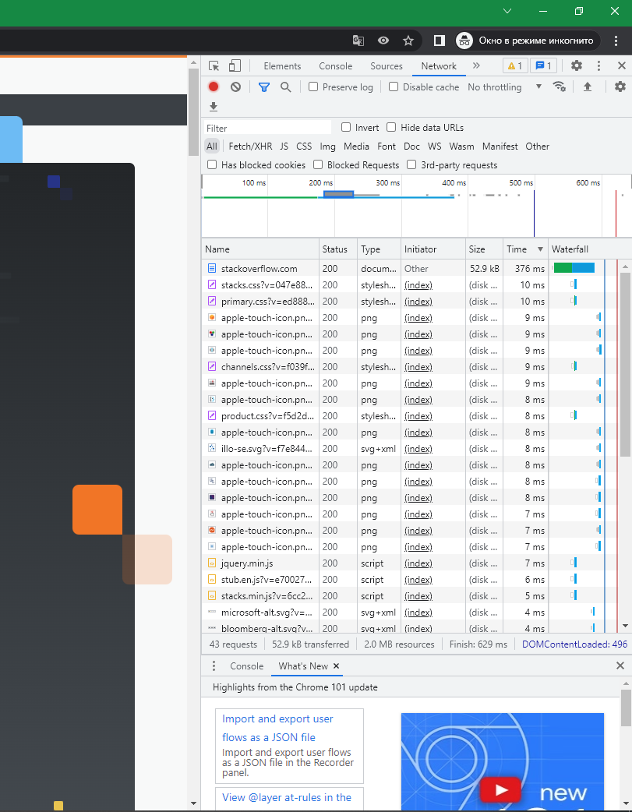  
**проверка EDGE**  
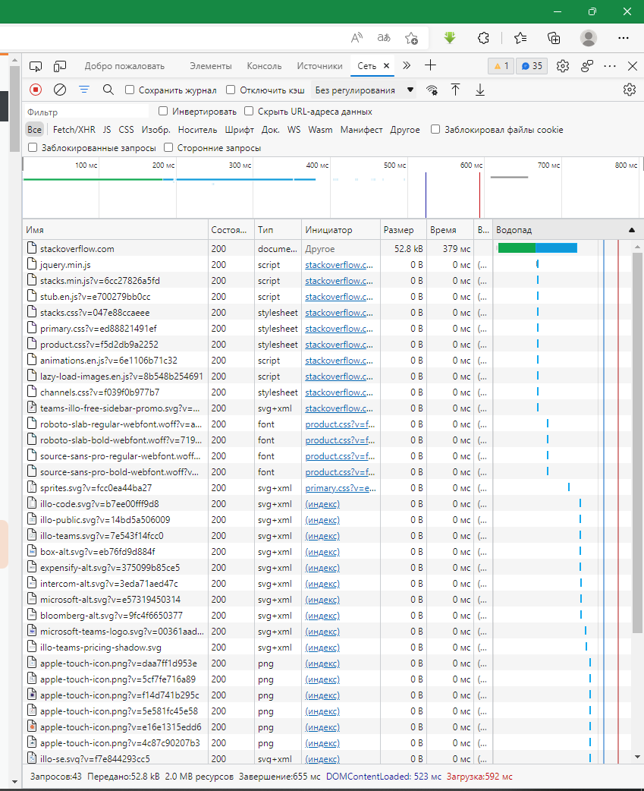  

3. Какой IP адрес у вас в интернете?  
4. Какому провайдеру принадлежит ваш IP адрес? Какой автономной системе AS? Воспользуйтесь утилитой `whois`  
    Ответ на 3 и 4:  
IP адрес динамический из подсети 128.74.0.0/16  
Провайдер - Билайн, автономная система - AS8402
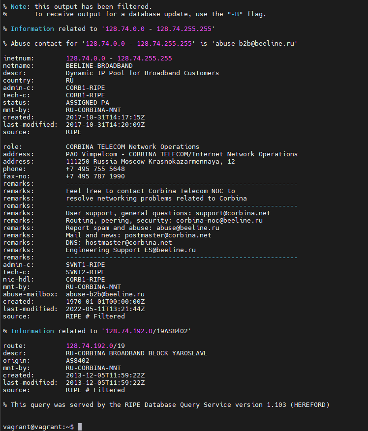  
5. Через какие сети проходит пакет, отправленный с вашего компьютера на адрес 8.8.8.8? Через какие AS? Воспользуйтесь утилитой `traceroute`  
    Ответ:  
Автономные системы, через которые проходят пакеты, обозначены квадратными скобками.  
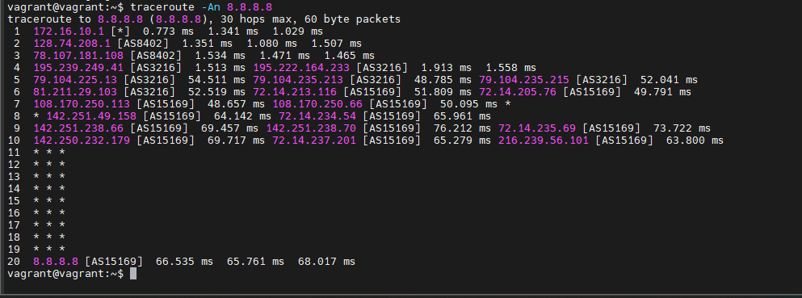  
6. Повторите задание 5 в утилите `mtr`. На каком участке наибольшая задержка - delay?  
    Ответ:  
Судя по ответу `mtr`, на 8-ом узле самая большая задержка.  
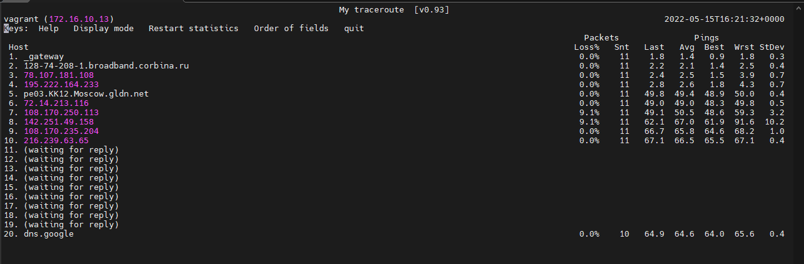  
7. Какие DNS сервера отвечают за доменное имя dns.google? Какие A записи? воспользуйтесь утилитой `dig`  
    Ответ:  
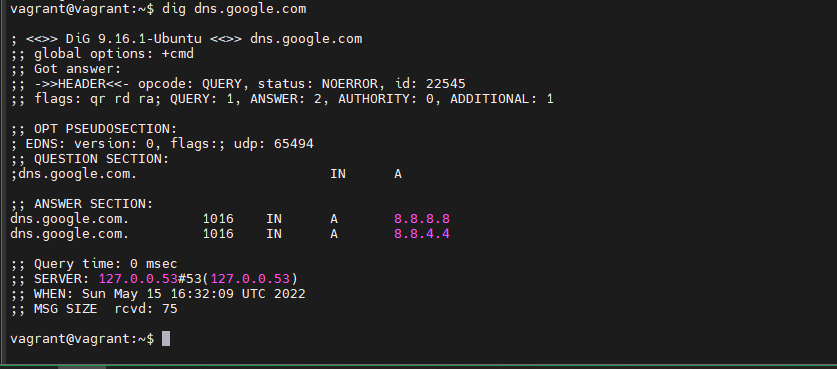  
8. Проверьте PTR записи для IP адресов из задания 7. Какое доменное имя привязано к IP? воспользуйтесь утилитой `dig`  
    Ответ:  
Привязанное имя - dns.google  
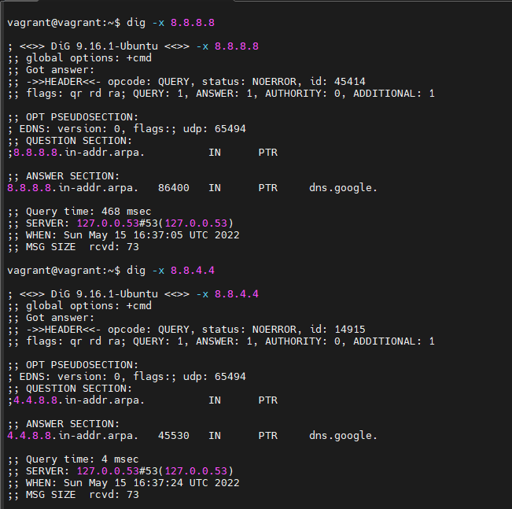  


