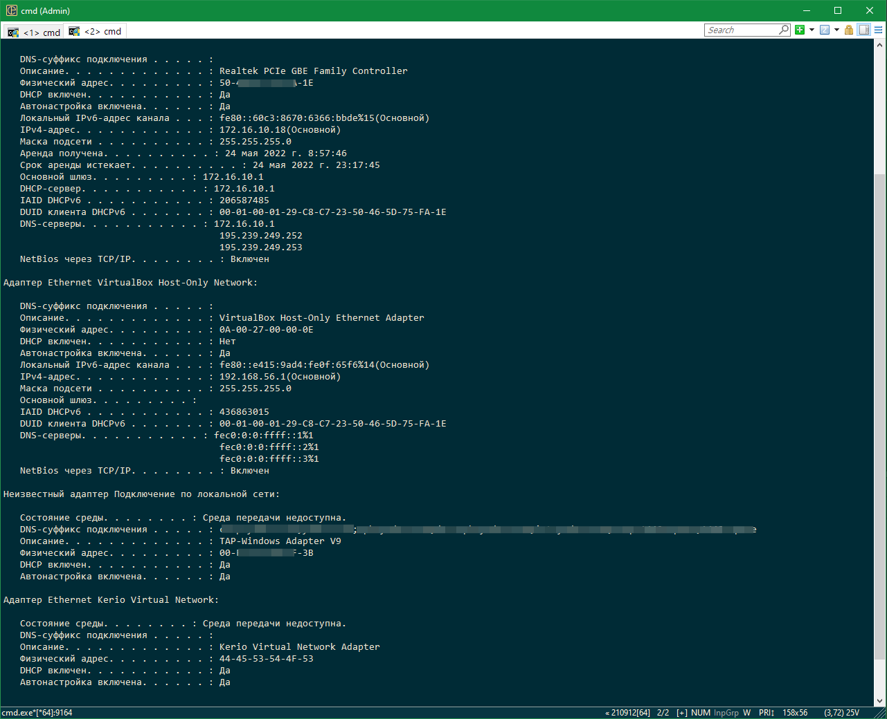

## Домашнее задание к занятию "3.7. Компьютерные сети, лекция 2"  

1. Проверьте список доступных сетевых интерфейсов на вашем компьютере. Какие команды есть для этого в Linux и в Windows?  
**Ответ:**  
 В Windows `ipconfig /all` покажет все доступные интерфейсы  
  

   В Linux `ifconfig` (так же можно использовать `ip` и `netplan`)  
  

2. Какой протокол используется для распознавания соседа по сетевому интерфейсу? Какой пакет и команды есть в Linux для этого?  
**Ответ:**  
*Link Layer Discovery Protocol (LLDP)* — протокол канального уровня, позволяющий сетевому оборудованию оповещать оборудование, работающее в локальной сети, о своём существовании и передавать ему свои характеристики, а также получать от него аналогичные сведения. Описание протокола приводится в стандарте IEEE 802.1AB-2009.  
Существуют проприетарные протоколы, например *CDP* (Cisco Discovery Protocol), *EDP* (Extreme Discovery Protocol) и др.  
Нужно установить lldp или lldpad.  

3. Какая технология используется для разделения L2 коммутатора на несколько виртуальных сетей? Какой пакет и команды есть в Linux для этого? Приведите пример конфига.  
**Ответ:**  
*VLAN* (Virtual Local Area Network) — виртуальная локальная компьютерная сеть. Представляет собой группу хостов с общим набором требований, которые взаимодействуют так, как если бы они были подключены к широковещательному домену независимо от их физического местонахождения.  
Установить можно `sudo apt-get install vlan`.  
Пример конфигурационного файла:  
```
# Конфигурация VLAN с ID – 100 для интерфейса eth0 #
DEVICE=eth0.100
BOOTPROTO=none
ONBOOT=yes
IPADDR=192.168.1.100
NETMASK=255.255.255.0
USERCTL=no
NETWORK=192.168.1.0
VLAN=yes
```  
4. Какие типы агрегации интерфейсов есть в Linux? Какие опции есть для балансировки нагрузки? Приведите пример конфига.  
**Ответ:**  

*mode=0 (balance-rr)*  
Режим используется по-умолчанию, если в настройках не указано другое. balance-rr обеспечивает балансировку нагрузки и отказоустойчивость. В данном режиме пакеты отправляются "по кругу" от первого интерфейса к последнему и сначала. Если выходит из строя один из интерфейсов, пакеты отправляются на остальные оставшиеся.При подключении портов к разным коммутаторам, требует их настройки.  

*mode=1 (active-backup)*  
При active-backup один интерфейс работает в активном режиме, остальные в ожидающем. Если активный падает, управление передается одному из ожидающих. Не требует поддержки данной функциональности от коммутатора.  

*mode=2 (balance-xor)*  
Передача пакетов распределяется между объединенными интерфейсами по формуле ((MAC-адрес источника) XOR (MAC-адрес получателя)) % число интерфейсов. Один и тот же интерфейс работает с определённым получателем. Режим даёт балансировку нагрузки и отказоустойчивость.  

*mode=3 (broadcast)*  
Происходит передача во все объединенные интерфейсы, обеспечивая отказоустойчивость.

*mode=4 (802.3ad)*  
Это динамическое объединение портов. В данном режиме можно получить значительное увеличение пропускной способности как входящего так и исходящего трафика, используя все объединенные интерфейсы. Требует поддержки режима от коммутатора, а так же (иногда) дополнительную настройку коммутатора.  

*mode=5 (balance-tlb)*  
Адаптивная балансировка нагрузки. При balance-tlb входящий трафик получается только активным интерфейсом, исходящий - распределяется в зависимости от текущей загрузки каждого интерфейса. Обеспечивается отказоустойчивость и распределение нагрузки исходящего трафика. Не требует специальной поддержки коммутатора.  

*mode=6 (balance-alb)*  
Адаптивная балансировка нагрузки (более совершенная). Обеспечивает балансировку нагрузки как исходящего (TLB, transmit load balancing), так и входящего трафика (для IPv4 через ARP). Не требует специальной поддержки коммутатором, но требует возможности изменять MAC-адрес устройства.  
Пример конфигурации:  
```
iface bond0 inet static
address 10.10.10.5
netmask 255.255.255.0
network 10.10.10.0
gateway 10.10.10.1
bond_mode balance-tlb
bond_miimon 100
bond_downdelay 200
bond_updelay 200
```  
    
5. Сколько IP адресов в сети с маской /29 ? Сколько /29 подсетей можно получить из сети с маской /24. Приведите несколько примеров /29 подсетей внутри сети 10.10.10.0/24.  

    **Ответ:**  
Маска /29 - адресов 8  
В сети с маской /24 можно получить 32 подсети с маской /29  
10.10.10.9/29  
10.10.10.16/29  
6. Задача: вас попросили организовать стык между 2-мя организациями. Диапазоны 10.0.0.0/8, 172.16.0.0/12, 192.168.0.0/16 уже заняты. Из какой подсети допустимо взять частные IP адреса? Маску выберите из расчета максимум 40-50 хостов внутри подсети.  
**Ответ:**  
Зарезервированное IANA адресное пространство 100.64.0.0/10, которое охватывает диапазоны 100.64.0.0 — 100.127.255.255.  
Как указано в [описании RFC 6598](https://tools.ietf.org/html/rfc6598), он предназначен для использования в сетях поставщиков услуг, однако его можно использовать аналогично частному адресному пространству RFC 1918 на оборудовании маршрутизации, которое может выполнять преобразование адресов между интерфейсами маршрутизатора, когда адреса идентичны.  
7. Как проверить ARP таблицу в Linux, Windows? Как очистить ARP кеш полностью? Как из ARP таблицы удалить только один нужный IP?  
**Ответ:**  
В Ubuntu и Windows используется команда `arp -a`.  
arp -d [inet_addr] - удаляет узел, задаваемый inet_addr. Параметр inet_addr может содержать знак шаблона * для удаления всех узлов.  
arp -d - очистка arp таблицы полностью.  
В Linux есть альтернативная команда просмотра arp-таблицы - `ip neigh`.
