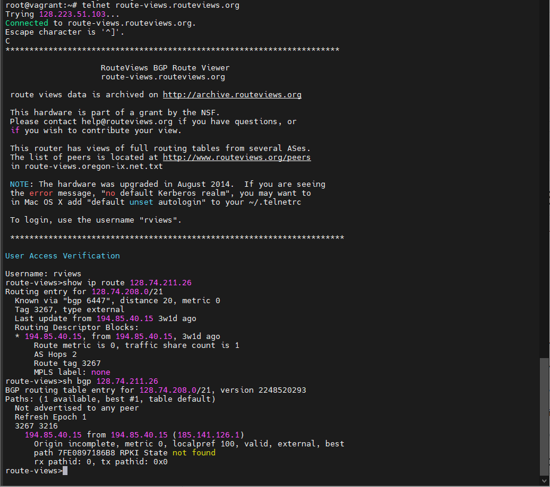
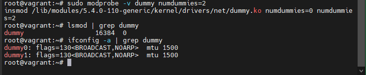
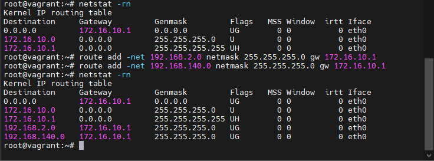
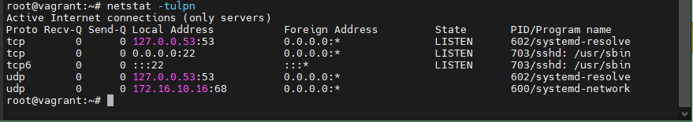
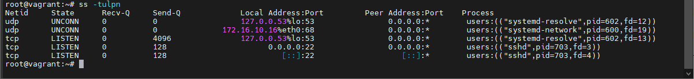
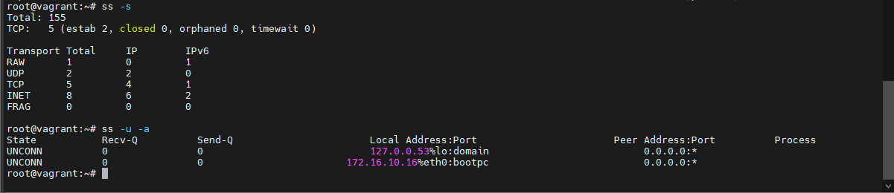
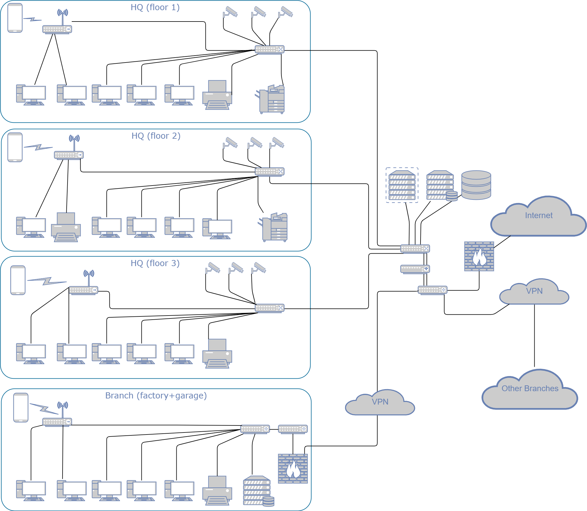

## Домашнее задание к занятию "3.8. Компьютерные сети, лекция 3"  

1. Подключитесь к публичному маршрутизатору в интернет. Найдите маршрут к вашему публичному IP  
```
telnet route-views.routeviews.org
Username: rviews
show ip route x.x.x.x/32
show bgp x.x.x.x/32
```  
  **Ответ:**  
       

2. Создайте dummy0 интерфейс в Ubuntu. Добавьте несколько статических маршрутов. Проверьте таблицу маршрутизации.  
  **Ответ:**  
       

       

3. Проверьте открытые TCP порты в Ubuntu, какие протоколы и приложения используют эти порты? Приведите несколько примеров.  
  **Ответ:**  
      

      
    Порт 22 - подключение по ssh  
    Порт 53 - DNS  
4. Проверьте используемые UDP сокеты в Ubuntu, какие протоколы и приложения используют эти порты?  
  **Ответ:**  
      
    Порт 53 - DNS  
    Порт 67 и 68 - BOOTP  
5. Используя diagrams.net, создайте L3 диаграмму вашей домашней сети или любой другой сети, с которой вы работали.  
  **Ответ:**  
      
