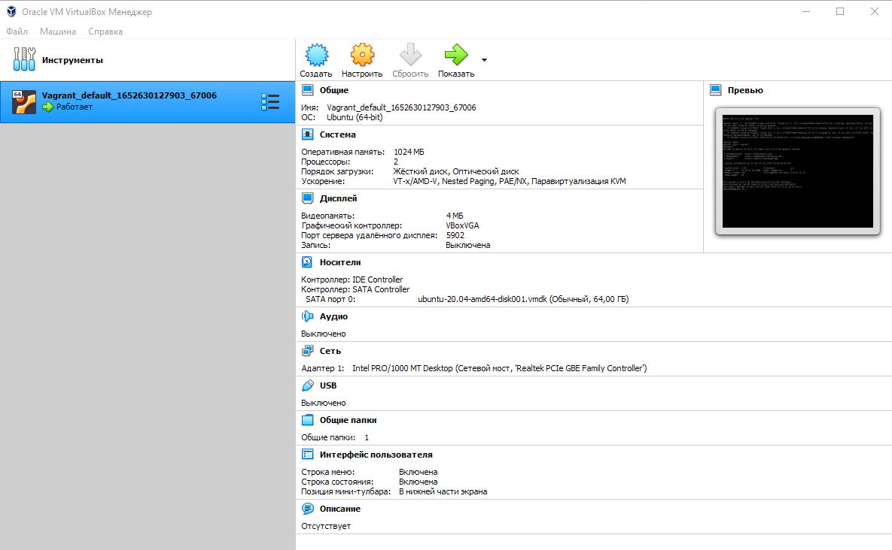
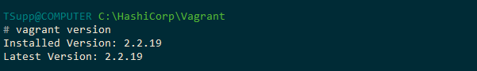
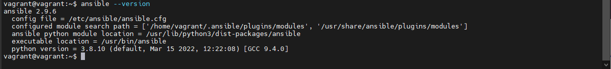
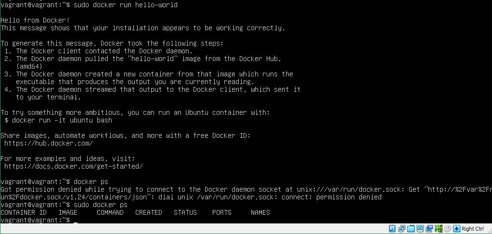

## Домашнее задание к занятию "5.2. Применение принципов IaaC в работе с виртуальными машинами"  

---

### Задача 1  
* Опишите своими словами основные преимущества применения на практике IaaC паттернов.  
* Какой из принципов IaaC является основополагающим?  

### Ответ  

* Некоторые преимущества, которых можно достичь, используя паттерны проектирования микросервисов:  
    - Уменьшение ошибок при проектировании микросервисов — без необходимости их рефакторинга в дальнейшем.  
    - Более быстрая и качественная миграция монолитов на микросервисную архитектуру.  
    - Предотвращение ненужных вызовов и неэффективного использования ресурсов.  
    - Отсутствие проблем с подключением новых сервисов, их интеграцией друг с другом и базами данных.  
    - Лучшая масштабируемость: добавление дополнительных сервисов не вызывает затруднений в обслуживании зависимостей.  
    - Повышение отказоустойчивости.  
    - Минимизация угроз безопасности, в том числе сокрытие конечных точек микросервисов.  
    - Сокращение работ по обслуживанию и отладке.  
* Основополагающим принципом IaaC является обеспечение идемпотентности. По моему мнению, именно паттерны, которые формировались в рамках развития той или технологии - квинтэссенция максимально эффективного опыта ИТ специалистов и обеспечивает стабильность получения предсказуемого постоянного результата.  
 
---  
### Задача 2  
* Чем Ansible выгодно отличается от других систем управление конфигурациями?  
* Какой, на ваш взгляд, метод работы систем конфигурации более надёжный push или pull?  

### Ответ  

* Ansible — это минималистичный и простой для изучения инструмент ИТ-автоматизации благодаря использованию YAML в скриптах конфигурирования. Он имеет большое количество встроенных модулей, которые можно использовать для абстрактных задач, таких как установка пакетов и работа с шаблонами. Его упрощенные требования к инфраструктуре и доступный синтаксис подходят тем, кто только начинает работать с управлением конфигурацией.  

* Несмотря на отсутствие практического опыта, попробую сделать вывод.  
Никогда не будет единого решения, подходящего для всех случаев, потому что нюансов всегда очень много и они зависят от конкретного варианта применения.  
Все же склоняюсь к pull. В основе pull лежит тот факт, что все изменения применяются изнутри кластера. Внутри кластера есть оператор, который регулярно проверяет связанные репозитории. Если в них происходят какие-либо изменения, состояние кластера обновляется изнутри. Считается, что подобный процесс весьма безопасен, поскольку ни у одного внешнего клиента нет доступа к правам администратора кластера.  
В push-подходе внешняя система (преимущественно CD-пайплайны) запускает развертывания в кластер после коммита в Git-репозиторий или в случае успешного выполнения предыдущего CI-пайплайна. В этом подходе система обладает доступом в кластер.  

---  

### Задача 3
Установить на личный компьютер:  
VirtualBox  
Vagrant  
Ansible  
Приложить вывод команд установленных версий каждой из программ, оформленный в markdown.  

### Ответ  

  

  

  

---  
---  

### Задача 4 *  

Воспроизвести практическую часть лекции самостоятельно.

* Создать виртуальную машину.
* Зайти внутрь ВМ, убедиться, что Docker установлен с помощью команды

### Ответ  

  

---  
